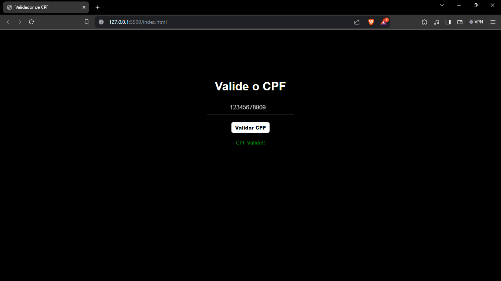

# Algoritmo Convertor de Temperatura
Algoritmo para converter temperatura em Celsius para Fahrenheit.

## Tecnologias
Esse projeto foi desenvolvido com as seguintes tecnologias:
- HTML5
- CSS3
- JS

## Projeto
O projeto está disponível pela platforma neiliy para ver [Clique aqui](https://celtofrh-rn.netlify.app/).

## Screenshot
